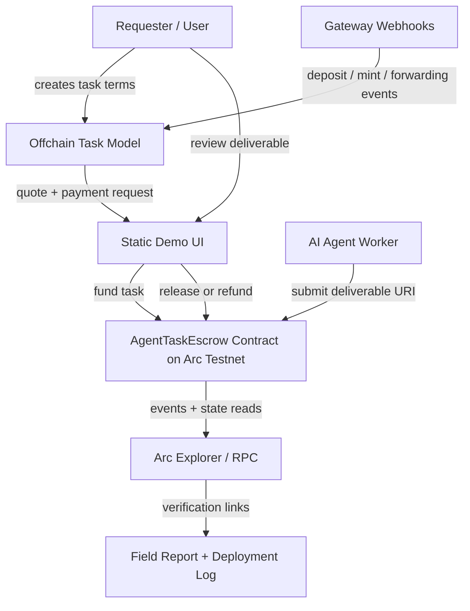

# Architecture

## Overview

AgentTaskEscrow separates the workflow into three layers:

1. Human/requester intent: create a task and decide whether to release payment.
2. AI-agent worker: accepts work, produces a deliverable, and submits a URI.
3. Arc settlement layer: records task funding, deliverable submission, release, and refund outcomes.

## Diagram



## Onchain contract flow

```text
fundTask(worker, metadataURI) -> Funded
submitDeliverable(taskId, deliverableURI) -> Submitted
release(taskId) -> Released
refund(taskId) -> Refunded, only before submission
```

## Why Arc matters here

Agentic payment workflows need predictable settlement and clear verification. Arc is useful for this prototype because it gives builders:

- fast settlement feedback during iteration
- USDC-native economic context
- simple explorer verification
- a testnet environment suitable for payment workflow experiments

## Gateway webhook extension

The current demo verifies settlement with transaction hashes, contract reads, and explorer links. A production-grade agent workflow should also support event-driven payment monitoring.

Gateway webhooks could notify the backend when a deposit or mint event is finalized for a registered wallet address. The task API can then dedupe the notification, update the task state, and notify the worker agent that a funded task is ready.

See [`gateway-webhook-notes.md`](gateway-webhook-notes.md) for the proposed event-driven monitoring pattern.

## Current limitation

The first contract uses native value for a minimal testnet learning flow. A production-grade version should add:

- ERC20 USDC settlement path when testnet token addresses are finalized for the use case
- deadline-based refunds
- dispute handling
- reputation or identity integration
- structured event indexing
- Gateway webhook monitoring for payment/funding state changes
- wallet UX using Circle Wallets
