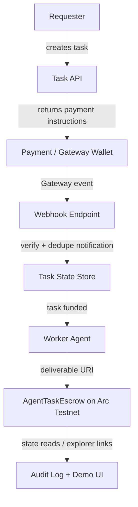

# Gateway Webhook Notes for AI-Agent Settlement Flows

Date: 2026-05-17

These notes capture a small follow-up from the Arc builder workflow: how Circle Gateway webhooks could fit an AI-agent task settlement pattern on Arc.

## Context

The current demo shows a simple task lifecycle:

1. A requester funds a task.
2. A worker or agent submits a deliverable URI.
3. The requester releases or refunds the task.
4. The project records explorer links and task state as proof.

Today this repo verifies the flow by checking contract state, transaction hashes, and Arc explorer links. For a production-like agent workflow, the next useful step is event-driven settlement monitoring instead of polling.

## Why webhooks matter

Gateway webhooks are useful when an app needs to react to payment or mint events without repeatedly polling RPC endpoints or dashboard APIs.

For an AI-agent settlement product, that means the backend can:

- detect when funds arrive for a registered wallet address;
- mark an agent task as funded;
- notify the worker agent that work can start;
- record settlement or forwarding events in an audit log;
- avoid duplicate processing by deduplicating webhook notification IDs.

## Possible architecture



## Webhook handler checklist

A minimal Gateway webhook handler for this use case should:

- accept HTTPS requests only;
- verify the webhook signature or provider-authenticated delivery mechanism when available;
- store the notification ID and reject duplicates;
- map the event to a known task or wallet address;
- write an append-only event record before triggering agent work;
- keep secrets, wallet keys, and webhook signing material outside the public repo;
- expose a human-readable audit trail for task funding and settlement.

## Event handling sketch

```text
on gateway.deposit.finalized:
  if notification_id already seen:
    return 200
  store raw event summary
  find task by destination wallet/address + expected amount
  mark task as funded_pending_agent
  enqueue worker agent

on gateway.mint.finalized:
  if notification_id already seen:
    return 200
  store raw event summary
  update settlement/audit status

on gateway.mint.forwarded:
  if notification_id already seen:
    return 200
  store raw event summary
  update forwarding status for crosschain flows
```

## Feedback from this prototype

The current Arc testnet contract flow made one thing clear: multi-actor workflows need explicit funding, monitoring, and audit states for every actor that signs or settles transactions.

Gateway webhooks would make that clearer by giving the application a structured event stream for funds and settlement states. The docs would be even stronger with a small sample that combines:

- a registered Gateway wallet/address;
- a webhook receiver;
- a dedupe table;
- a task state transition;
- an Arc testnet transaction or explorer link.

## Implemented mock demo

This repo now includes a lightweight mock Gateway webhook path in the local demo:

```text
mock Gateway event -> dedupe notification_id -> task state update -> static UI audit row
```

Implemented pieces:

- `createMockGatewayEvent(task, overrides)` builds a test event.
- `applyGatewayWebhook(task, event, seenNotificationIds)` validates event type, dedupes notification IDs, and updates task state.
- The browser demo renders a **Gateway webhook audit** card showing the incoming event, updated task status, audit log, and duplicate replay result.
- Node tests cover both the accepted event path and duplicate notification handling.

This is intentionally a mock path: it does not use real Gateway credentials, webhooks, or funds. It is a safe local bridge from architecture notes to runnable repo behavior.

## Next experiment

A useful next experiment would be a small HTTP webhook receiver:

```text
mock HTTP POST -> webhook receiver -> dedupe store -> task state update -> static UI audit row
```

That can still be implemented without real funds or secrets and later replaced with real Gateway events when the account and webhook endpoint are ready.
